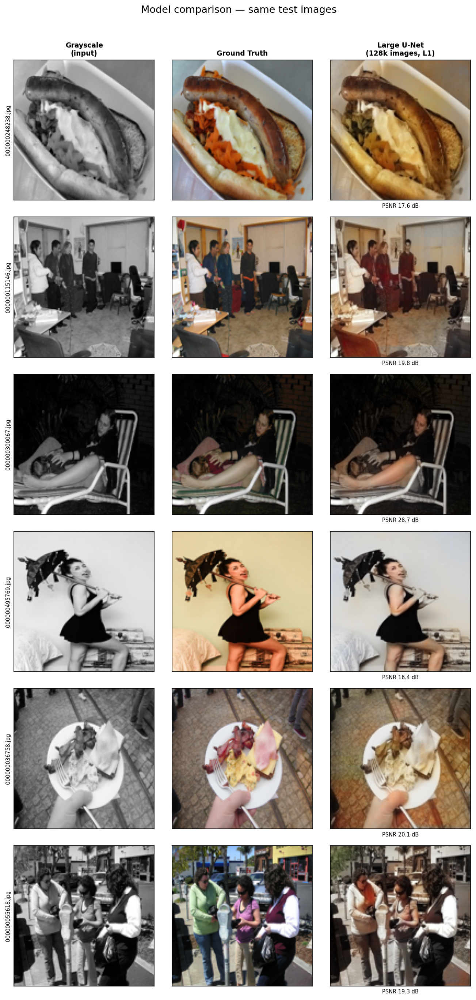
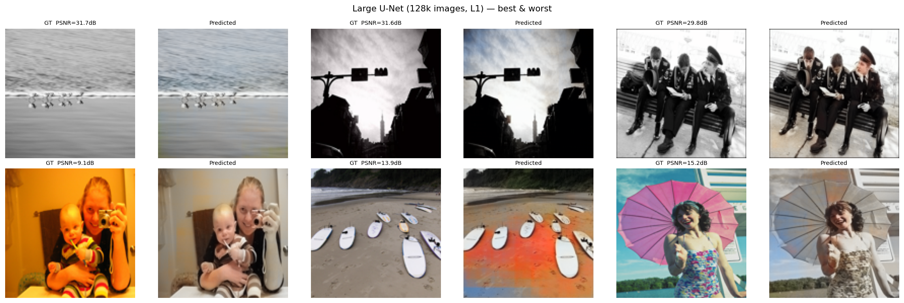
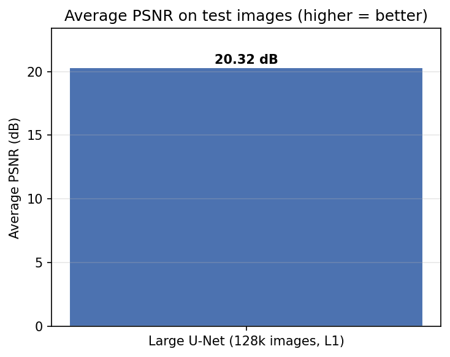

# Image Colorization with Deep Learning

## Introduction

This project explores automatic grayscale-to-color image conversion using deep neural networks. We built and trained three progressively more sophisticated models, each one addressing a weakness in the previous. The starting point was a simple U-Net trained with pixel-level loss. From there we introduced adversarial training to push the colors toward perceptual realism, and finally added a VGG-based perceptual loss and a two-stage training strategy to stabilize and improve the GAN.

All three models share the same fundamental setup: images are converted to the LAB color space, the grayscale L channel is passed to the network as input, and the model predicts the A and B color channels. The L channel is kept from the input and recombined with the predicted AB to produce the final colorized image.

## Methods

### LAB Color Space

Working in LAB rather than RGB is one of the most important design decisions in this project. In RGB, color and brightness are entangled — changing one channel changes the perceived brightness. LAB separates them completely: L is lightness, A is the green-red axis, and B is the blue-yellow axis.

This separation means the network never has to "relearn" the lightness that's already present in the grayscale input. It only has to predict two channels instead of three, and those channels correspond directly to color rather than a mix of color and brightness.

The dataset loading code converts each image before it ever reaches the network:

```python
lab = skcolor.rgb2lab(rgb_np).astype(np.float32)

L_t  = torch.from_numpy(lab[:, :, 0:1].transpose(2, 0, 1)) / 50.0 - 1.0
ab_t = torch.from_numpy(lab[:, :, 1:3].transpose(2, 0, 1)) / 110.0
```

The normalization to `[-1, 1]` matches the `tanh` activation on the output layer, so the network's natural output range aligns with the target range.

### U-Net Architecture

All three models use a U-Net generator. The encoder compresses the image into a compact representation by halving the spatial size at each step while doubling the number of channels. The decoder then reverses this, growing the feature maps back to the original resolution. Skip connections bridge matching encoder and decoder levels — they carry fine spatial detail (edges, object boundaries) directly from the encoder to the decoder, bypassing the bottleneck where that detail would otherwise be lost.

```python
def forward(self, x):
    e1 = self.enc1(x)
    e2 = self.enc2(self.pool(e1))
    e3 = self.enc3(self.pool(e2))
    m  = self.mid(self.pool(e3))
    d3 = self.dec3(torch.cat([self.up3(m),  e3], dim=1))
    d2 = self.dec2(torch.cat([self.up2(d3), e2], dim=1))
    d1 = self.dec1(torch.cat([self.up1(d2), e1], dim=1))
    return torch.tanh(self.out(d1))
```

The `torch.cat` calls are the skip connections — each decoder block receives its upsampled input concatenated with the matching encoder features, which doubles the channel count going into each `conv_block`.

### Evaluation Metrics

We use two main metrics throughout the project.

**PSNR** (Peak Signal-to-Noise Ratio) measures how close the predicted pixels are to the ground truth. It's derived from mean squared error: `PSNR = 10 × log₁₀(1 / MSE)`. Higher is better; typical colorization results fall in the 20–30 dB range. The limitation of PSNR is that it treats all pixels equally — a single wrong pixel in a critical region hurts the same as one in a uniform background.

**SSIM** (Structural Similarity Index) measures perceived structural similarity by comparing luminance, contrast, and local structure between patches. Since the L channel is always correct (it's the input), SSIM tends to be high across all our models — the structure is always right, only the color might be off.

---

## Model 1 — Baseline U-Net (`colorization.ipynb`)

The first notebook establishes the baseline. A two-level U-Net (64 → 128 channels, 256 bottleneck) is trained with plain L1 loss on 8,000 COCO images. The optimizer is Adam with a learning rate of `1e-3`, no scheduling, no augmentation, 10 epochs.

```python
class UNet(nn.Module):
    def __init__(self):
        super().__init__()
        self.enc1 = conv_block(1,   64)
        self.enc2 = conv_block(64, 128)
        self.pool = nn.MaxPool2d(2)
        self.mid  = conv_block(128, 256)
        self.up2  = nn.ConvTranspose2d(256, 128, kernel_size=2, stride=2)
        self.dec2 = conv_block(256, 128)
        self.up1  = nn.ConvTranspose2d(128, 64, kernel_size=2, stride=2)
        self.dec1 = conv_block(128, 64)
        self.out  = nn.Conv2d(64, 2, 1)
```

Training is straightforward — one forward pass, L1 loss against the ground-truth AB channels, backprop:

```python
criterion = nn.L1Loss()
optimizer = torch.optim.Adam(model.parameters(), lr=1e-3)

pred = model(L_batch)
loss = criterion(pred, ab_batch)
optimizer.zero_grad()
loss.backward()
optimizer.step()
```

The model converges smoothly: train L1 goes from 0.0736 at epoch 1 to 0.0717 at epoch 10, validation L1 from 0.0708 to 0.0693. No early stopping was applied — the model was still slowly improving at epoch 10.

**Test results: PSNR 23.42 dB, SSIM 0.9160**

The baseline produces plausible colorizations for simple scenes but tends to be conservative — it plays it safe with desaturated, grayish colors. L1 loss minimizes the average pixel error, which pushes the model toward the mean of all possible colors rather than committing to a specific hue. The result is technically correct but often visually dull.

---

## Model 2 — Single-Stage cGAN (`colorization_gan.ipynb`)

The second notebook adds a conditional GAN on top of the same U-Net backbone. The idea is that the generator can no longer just minimize pixel error — it also has to fool a discriminator that's trying to tell real colorizations from fake ones. This adversarial pressure should push the model toward more vivid, realistic colors.

The discriminator uses the PatchGAN design from the original pix2pix paper. Rather than judging the whole image real or fake, it classifies overlapping patches independently. This keeps the adversarial signal focused on local texture and color rather than global composition.

```python
class Discriminator(nn.Module):
    def __init__(self):
        super().__init__()
        self.model = nn.Sequential(
            d_block(3,   64,  stride=2, bn=False),
            d_block(64,  128, stride=2),
            d_block(128, 256, stride=2),
            d_block(256, 512, stride=1),
            nn.Conv2d(512, 1, kernel_size=4, padding=1),
        )

    def forward(self, L, ab):
        x = torch.cat([L, ab], dim=1)  # condition on L
        return self.model(x)
```

Conditioning the discriminator on L (by concatenating it with the AB channels) is what makes this a *conditional* GAN. The discriminator doesn't just ask "does this look like a real colored image?" — it asks "does this colorization make sense given this specific grayscale image?" That's a much harder and more useful constraint.

The generator loss combines adversarial loss with an L1 term weighted by `LAMBDA_L1 = 100`:

```python
loss_G_adv = criterion_bce(D(L_t, ab_fake), real_labels)
loss_G_l1  = criterion_l1(ab_fake, ab_real) * LAMBDA_L1
loss_G     = loss_G_adv + loss_G_l1
```

The L1 term keeps the generator from mode collapse — without it, the adversarial loss alone would cause the network to generate colorful but completely wrong images that happen to fool the discriminator.

This notebook also introduced a few training improvements: `ReduceLROnPlateau` scheduling, early stopping with patience of 8, and horizontal flip augmentation. The best generator weights are cached in RAM using `copy.deepcopy` and restored at the end.

**Test results: PSNR 20.57 dB, SSIM 0.9281**

Counterintuitively, this model scores *lower* PSNR than the baseline. This is expected — the adversarial loss actively pushes the generator away from pixel-perfect ground truth toward perceptually realistic outputs. The colors are more vibrant, but they won't always match the exact ground-truth hue, which hurts PSNR. The higher SSIM (0.9281 vs 0.9160) reflects that the structural quality improved even if pixel-level accuracy dropped.

Training never fully stabilized. The discriminator loss oscillates between 0.35 and 0.54 across epochs rather than converging near the ideal 0.5. Starting GAN training from random weights on only 2,000 images with no warmup makes cold-start instability almost unavoidable.

---

## Model 3 — Two-Stage cGAN (`colorization_final.ipynb`)

The third notebook addresses the instability problem directly with a two-stage training strategy, and adds VGG perceptual loss on top.

### Stage 1 — L1 Pretrain

The generator trains on L1 loss alone for 20 epochs before the discriminator is introduced. This gives it a solid starting point — it already knows how to produce roughly correct colors before adversarial training begins. The pretrained weights are saved to disk and loaded at the start of Stage 2.

```python
def pretrain_generator(train_loader, val_loader, epochs, lr, save_path):
    G         = init_weights(Generator().to(device))
    opt       = torch.optim.Adam(G.parameters(), lr=lr, betas=(0.5, 0.999))
    criterion = nn.L1Loss()
    scheduler = torch.optim.lr_scheduler.ReduceLROnPlateau(
        opt, mode='min', factor=0.5, patience=4
    )
    ...
```

The pretrain reaches a best validation L1 of **0.07879** at epoch 19 — the best pure L1 result among all three models on a comparable dataset size.

### Stage 2 — GAN Fine-tuning with VGG Loss

Stage 2 loads the pretrained generator and introduces both the discriminator and VGG perceptual loss. The generator loss now has three components:

```python
loss_G_adv = gan_loss(D(L_t, ab_fake), target_is_real=True)
loss_G_l1  = l1_loss(ab_fake, ab_real) * LAMBDA_L1   # 150
loss_G_vgg = vgg_loss(L_t, ab_fake, ab_real) * LAMBDA_VGG  # 10
loss_G     = loss_G_adv + loss_G_l1 + loss_G_vgg
```

The VGG perceptual loss is the most technically involved part of the project. It requires differentiable LAB-to-RGB conversion — normally this conversion goes through scikit-image, which breaks the gradient graph. Instead, the whole conversion is re-implemented in PyTorch so gradients can flow from VGG feature space back through the color conversion into the generator.

```python
def lab_to_rgb_tensor(L, ab):
    L_  = (L + 1.0) * 50.0
    a_  = ab[:, 0:1] * 110.0
    b_  = ab[:, 1:2] * 110.0

    fy = (L_ + 16.0) / 116.0
    fx = a_ / 500.0 + fy
    fz = fy - b_ / 200.0

    xr = torch.where(fx**3 > eps, fx**3, (116.0*fx - 16.0) / kappa)
    yr = torch.where(L_ > kappa*eps, ((L_+16.0)/116.0)**3, L_/kappa)
    zr = torch.where(fz**3 > eps, fz**3, (116.0*fz - 16.0) / kappa)

    X, Y, Z = xr * 0.95047, yr * 1.00000, zr * 1.08883
    R =  3.2406*X - 1.5372*Y - 0.4986*Z
    ...
```

A frozen VGG16 (up to `relu2_2`) extracts feature maps from both the predicted and ground-truth RGB images. L1 distance in feature space penalizes perceptual differences — textures and edges that look wrong — rather than just pixel differences. The VGG weights are frozen throughout, so it only acts as a fixed feature extractor.

```python
class VGGPerceptualLoss(nn.Module):
    def __init__(self):
        super().__init__()
        vgg = models.vgg16(weights=models.VGG16_Weights.IMAGENET1K_V1)
        self.features = nn.Sequential(*list(vgg.features)[:10]).eval()
        for p in self.parameters():
            p.requires_grad = False

    def forward(self, L, ab_pred, ab_real):
        pred_rgb = lab_to_rgb_tensor(L, ab_pred)
        true_rgb = lab_to_rgb_tensor(L, ab_real)
        pred_f = self.features((pred_rgb - self.mean) / self.std)
        true_f = self.features((true_rgb - self.mean) / self.std)
        return nn.functional.l1_loss(pred_f, true_f.detach())
```

Learning rate scheduling in Stage 2 uses `StepLR` (halved every 10 epochs) rather than `ReduceLROnPlateau` — a fixed schedule is less sensitive to noisy validation loss during adversarial training.

**Test results: PSNR 27.44 dB, SSIM 0.8756**

The jump from 23.42 dB (baseline) to 27.44 dB is significant — about 4 dB, which corresponds to roughly half the pixel error. The lower SSIM compared to the Single-Stage cGAN reflects that VGG perceptual loss drives the model toward richer, more saturated colors that may differ structurally from the exact ground-truth hue. For colorization this is actually desirable: a vivid, plausible color is better than a washed-out one that exactly matches the ground truth.

---

## Visual Results

### Side-by-Side Model Comparison

The grid below shows six test images run through each available model. The left column is the grayscale input; the middle is the ground truth; remaining columns show model outputs with PSNR scores.



### Best and Worst Results — Large U-Net

The top row shows the three images where the model performed best; the bottom row shows where it struggled most. Common failure cases are images with unusual lighting, ambiguous content (rocks, concrete, bare wood), or scenes where many color choices are equally plausible.



### PSNR Comparison



---

## Results Summary

The Two-Stage cGAN is the strongest model on quantitative metrics, achieving 27.44 dB PSNR — 4 dB higher than the Baseline U-Net and 7 dB higher than the Single-Stage cGAN.

The Single-Stage cGAN has the highest SSIM (0.9281) despite the lowest PSNR (20.57 dB). This reflects the adversarial training producing structurally coherent colors that the SSIM metric rewards, while pixel-level fidelity (PSNR) drops because the colors diverge from the exact ground truth.

The Baseline U-Net is competitive for such a simple model — 23.42 dB with just L1 loss and 10 epochs of training. Its main weakness is color saturation: the output tends to be visibly more muted than either GAN model.

A key caveat: these models trained on different datasets (4k, 2k, and 8k images respectively), so the comparison is not perfectly controlled. The Two-Stage cGAN's advantage comes from both a better training strategy and more training data.

---

## Problems Encountered

Building these models was not without friction. Several issues came up during development that are worth documenting.

**GPU compatibility with the RTX 50xx series.** The RTX 50xx uses the Blackwell architecture, which requires CUDA 12.8. The standard `pip install torch` pulls a build compiled against an older CUDA version and silently falls back to CPU. 

```
pip install torch torchvision --index-url https://download.pytorch.org/whl/cu128
```

This wasn't obvious from the PyTorch website at the time and cost some time to debug and make it work.

**DirectML import crash.** The Large U-Net notebook had an unconditional import torch_directml at the top of the imports cell, outside any try/except block. On a machine without DirectML installed this immediately raised ModuleNotFoundError and made the entire notebook unrunnable. The import had to be moved inside a try/except so that the notebook degrades gracefully to CPU rather than crashing.

**LAB-to-RGB conversion warnings.** scikit-image's `lab2rgb` frequently prints `UserWarning: Conversion from CIE-LAB, via XYZ to sRGB color space resulted in negative Z values` when AB values fall slightly outside the valid LAB gamut. This happened constantly during training and evaluation, flooding the notebook output with hundreds of warning lines per epoch. The fix was to wrap every call in a `warnings.catch_warnings()` context manager and suppress the warning, and to add `warnings.filterwarnings('ignore', message='.*negative Z.*')` at the top of any evaluation cell as a safety net.

**Gradients don't flow through scikit-image.** When implementing VGG perceptual loss for `colorization_final.ipynb`, the naive approach was to convert LAB to RGB using scikit-image before passing to VGG. This breaks the gradient graph — scikit-image operates on numpy arrays, so any gradient signal from VGG's feature comparison cannot propagate back into the generator. The solution was to re-implement the entire LAB→XYZ→sRGB conversion chain in pure PyTorch, which keeps everything differentiable and lets the VGG loss actually update the generator weights.

**GAN training instability.** The Single-Stage cGAN never fully stabilized during training. The discriminator loss alternated between periods where it dominated the generator (D loss near 0.35) and periods where the generator fooled it too easily (D loss near 0.54), rather than settling near the ideal 0.5. This instability is the core motivation for the two-stage approach in the third notebook — pre-training the generator with L1 first means it enters adversarial training already producing plausible outputs, which keeps the discriminator from gaining an overwhelming early advantage.

**Desaturated outputs from L1 training.** Early in the project, all models trained purely with L1 loss produced visibly desaturated colorizations — browns and grays rather than vivid colors. This is not a bug but a fundamental property of L1 minimization: it finds the prediction that minimizes average error, which is the mean of all plausible colors for a given patch. When multiple colors are equally likely (a car can be red, blue, or white), the model correctly minimizes L1 by outputting a grayish average. The GAN loss and VGG perceptual loss were both added specifically to break this tendency.

---

## Conclusion

The progression across these three models makes the key lessons concrete. L1 loss alone produces reasonable results but pulls colors toward the mean. Adding adversarial training introduces richer colors but needs stabilization. Two-stage training solves the cold-start problem and, combined with VGG perceptual loss, produces the best results by a clear margin.

The natural next step is applying the Two-Stage cGAN architecture to the full 128k COCO dataset used by the Large U-Net. The infrastructure is already in place — it's just a matter of pointing `colorization_final.ipynb` at the larger dataset. On the same data, the Two-Stage + VGG approach would be expected to clearly outperform a plain U-Net trained with L1 only.
